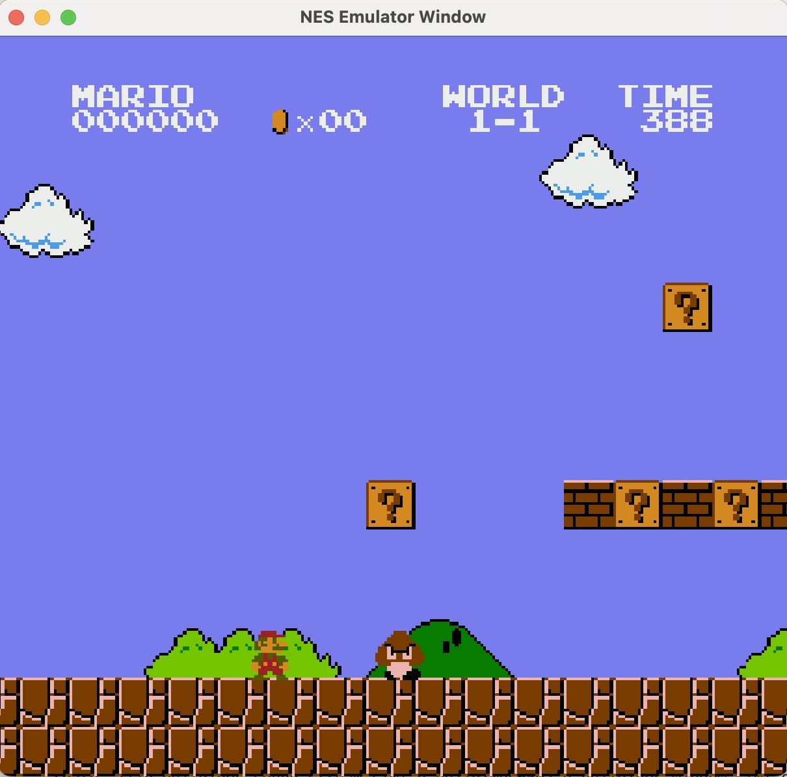
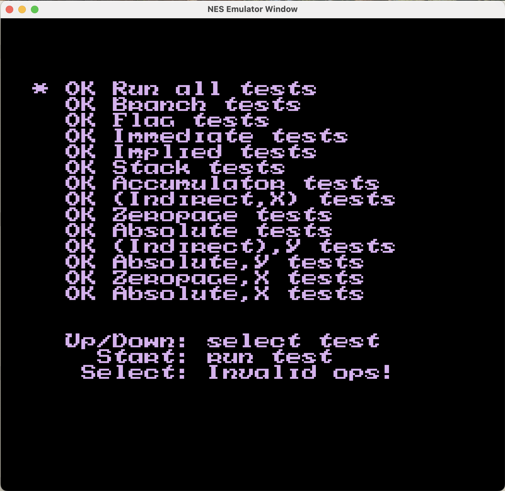

# NES Emulator #

This is a NES Emulator that I built from scratch with the help of online resources such as OLC's NES Emulator Series on [YouTube](https://www.youtube.com/watch?v=nViZg02IMQo&list=PLrOv9FMX8xJHqMvSGB_9G9nZZ_4IgteYf), NESDev Wiki, and other available sources online.

## Features ##

* Cycle-count accurate CPU and PPU Emulation
* Support of games using Mapper 0
* Basic sound channels (Pulse and Triangle)
* Tested using various test roms

## TODOS ##

* Support for Unofficial CPU Opcode
* Implement Hardware Sprite Overflow Bug
* Adding more Mapper support
* Finish implementing Noise and DMC sound channel
* Cycle accurate CPU and PPU Emulation

## Screen Shots ##

